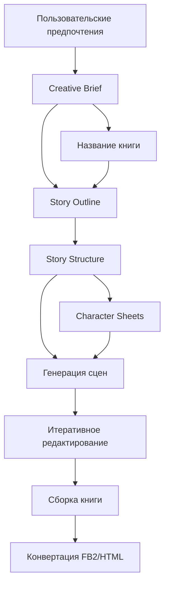

# Процесс генерации книги

## Общая схема



## Этапы и параметры

### 1. Пользовательские предпочтения
Сбор базовых параметров для генерации книги.

**Параметры:**
- Жанр книги
- Целевая аудитория
- Размер книги
- LLM-сервис

### 2. Creative Brief
Создание детального описания концепции книги на основе пользовательских предпочтений.

**Параметры генерации:**
- Temperature: 1.2
- Max Tokens: 4000
- JSON Mode: True

**Выходные данные:**
```json
{
    "concept": {
        "genre": "жанр книги",
        "target_audience": "описание целевой аудитории",
        "themes": ["тема1", "тема2"],
        "tone": "тон повествования"
    },
    "world": {
        "setting": "описание мира",
        "time_period": "временной период",
        "key_locations": ["локация1", "локация2"]
    },
    "characters": {
        "protagonist": {
            "name": "имя главного героя",
            "description": "описание персонажа"
        },
        "antagonist": {
            "name": "имя антагониста",
            "description": "описание персонажа"
        }
    },
    "plot": {
        "main_conflict": "основной конфликт",
        "key_events": ["событие1", "событие2"]
    }
}
```

### 3. Название книги
Генерация названия на основе Creative Brief.

**Параметры генерации:**
- Temperature: 1.5 (высокая для креативности)
- Max Tokens: 500
- JSON Mode: True

**Выходные данные:**
```json
{
    "title": "Название книги",
    "explanation": "Объяснение выбора названия"
}
```

### 4. Story Outline
Создание общей структуры сюжета на основе Creative Brief и названия.

**Параметры генерации:**
- Temperature: 1.2 (средне-высокая для баланса)
- Max Tokens: 4000
- JSON Mode: True

**Выходные данные:**
```json
{
    "book_size": "размер книги",
    "synopsis": "краткое описание сюжета",
    "themes": ["темы"],
    "plot_points": {
        "setup": {},
        "inciting_incident": {},
        "rising_action": {},
        "climax": {},
        "resolution": {}
    },
    "locations": [],
    "characters": []
}
```

### 5. Story Structure
Детальное планирование глав и сцен на основе Story Outline.

**Параметры генерации:**
- Temperature: 0.8 (низкая для точной структуры)
- Max Tokens: 4000
- JSON Mode: True

**Выходные данные:**
```json
{
    "chapters": [
        {
            "number": 1,
            "title": "название главы",
            "target_word_count": "4500-7500",
            "scenes": [
                {
                    "number": 1,
                    "title": "название сцены",
                    "target_word_count": "1500-2000",
                    "pacing": "темп",
                    "scene_structure": {}
                }
            ]
        }
    ]
}
```

### 6. Character Sheets
Создание детальных описаний персонажей на основе Story Outline.

**Параметры генерации:**
- Temperature: 1.0 (баланс уникальности и последовательности)
- Max Tokens: 3000
- JSON Mode: True

### 7. Генерация и редактирование сцен
Создание и итеративное улучшение текста сцен.

#### 7.1 Генерация первичного текста
**Параметры генерации:**
- Temperature: 1.5 (высокая для креативного повествования)
- Max Tokens: 8000
- JSON Mode: False

#### 7.2 Итеративное редактирование
Каждая сцена проходит через несколько итераций улучшения:

**Параметры редактирования:**
- Temperature: 0.7 (низкая для точности правок)
- Max Tokens: 8000
- Iterations: 3-5

**Аспекты редактирования:**
- Улучшение стиля и языка
- Проверка согласованности с Character Sheets
- Соответствие тону и атмосфере
- Исправление логических несоответствий
- Улучшение диалогов и описаний

### 8. Сборка книги и конвертация
Объединение всех сцен в единый документ и конвертация в различные форматы.

**Процесс:**
1. Сборка markdown-файла с оглавлением
2. Конвертация в FB2 формат
3. Конвертация в HTML формат

## Зависимости между этапами

1. **Пользовательские предпочтения** - начальный этап

2. **Creative Brief** зависит от:
   - Пользовательских предпочтений

3. **Название** зависит от:
   - Creative Brief

4. **Story Outline** зависит от:
   - Creative Brief
   - Названия

5. **Story Structure** зависит от:
   - Story Outline

6. **Character Sheets** зависят от:
   - Story Outline

7. **Генерация сцен** зависит от:
   - Story Structure
   - Character Sheets

8. **Сборка книги** зависит от:
   - Отредактированных сцен

9. **Конвертация в FB2** зависит от:
   - Собранной книги в markdown

## Тестирование

Для каждого этапа доступен отдельный тестовый режим:
```bash
python main.py --stage 1  # Начать с предпочтений
python main.py --stage 2  # Начать с Creative Brief
python main.py --stage 3  # Начать с названия
python main.py --stage 4  # Начать с Story Outline
python main.py --stage 5  # Начать с Story Structure
python main.py --stage 6  # Начать с Character Sheets
python main.py --stage 7  # Начать с генерации сцен
python main.py --stage 8  # Начать со сборки книги
``` 